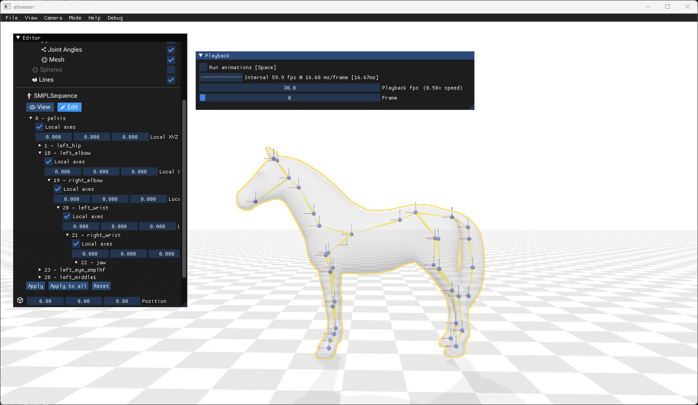
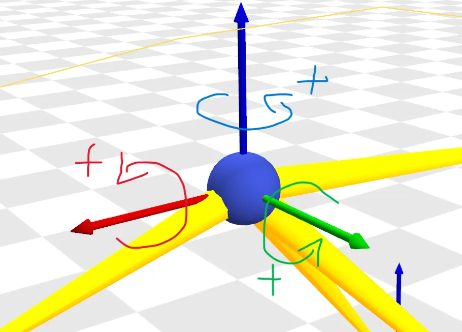
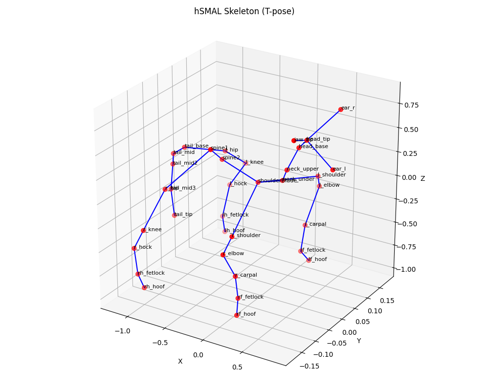

# The Poses for Equine Research Dataset (PFERD)

ステータス: 進行中
作成日時: 2025年7月27日 22:49
進捗率: 0
教授へ報告済: No
サブアイテム: PFERDのデータ解析の続き　馬の移動速度、ストライド、ピッチ (https://app.notion.com/p/PFERD-27dd42dfe4ce80fa9744fe354b7ba5c3?pvs=21)

[脚部　基本設計](https://app.notion.com/p/23dd42dfe4ce810baef4c9f281248e10?pvs=21) 

### 目的

- ロボットの設計において目標となる馬のデータを収集する

### 達成目標

- [ ]  

### まとめ

- 

### 次回

- 

### 関連情報（参考文献・添付ファイル）

[The Poses for Equine Research Dataset (PFERD)](https://www.nature.com/articles/s41597-024-03312-1?utm_source=chatgpt.com)

[AMASS](https://amass.is.tue.mpg.de/)

[Getting Started](https://eth-ait.github.io/aitviewer/)

[https://github.com/eth-ait/aitviewer](https://github.com/eth-ait/aitviewer)

# 本文

**hSMALモデルのテンプレートポーズ（Tポーズ）**



馬の動作研究のための新しいデータセットであるPFERD（Poses for Equine Research Dataset）

目的は：**コンピュータビジョン技術を用いたマーカーレスモーションキャプチャの開発**を支援し、**馬の生体力学的研究を促進する**こと

**github　オープンソースデータ　フォーク済み**

[https://github.com/Celiali/PFERD](https://github.com/Celiali/PFERD)

**引用**

このコードが研究に役立つと思われる場合やデータセットを使用する場合は、次の論文を引用することを検討してください。

```markdown
@article{li2024poses,
  title={The Poses for Equine Research Dataset (PFERD)},
  author={Li, Ci and Mellbin, Ylva and Krogager, Johanna and Polikovsky, Senya and Holmberg, Martin and Ghorbani, Nima and Black, Michael J and Kjellstr{\"o}m, Hedvig and Zuffi, Silvia and Hernlund, Elin},
  journal={Scientific Data},
  volume={11},
  number={1},
  pages={497},
  year={2024},
  publisher={Nature Publishing Group UK London}
}
```

# この論文の概要　Notebooklmより

- 概要
    
    提示された出典は、**馬の動作研究のための新しいデータセットであるPFERD（Poses for Equine Research Dataset）**について説明しています。このデータセットは、**5頭の異なる体格の馬から収集された、詳細な3Dマーカーモーションデータと同期されたビデオ**で構成されています。その目的は、**コンピュータビジョン技術を用いたマーカーレスモーションキャプチャの開発**を支援し、**馬の生体力学的研究を促進する**ことにあります。データは、**歩行からより複雑な動きまで、多様な馬の姿勢**を網羅しており、**動物の動作解析における既存のデータギャップを埋める**ことを目指しています。PFERDは、**馬の健康と福祉に貢献する**ための、オープンアクセスなリソースとして提供されています。
    
- 馬の動作研究とコンピュータビジョン開発における重要なデータギャップを埋めることを目的としています。
    
    PFERD（The Poses for Equine Research Dataset）データセットは、**馬の動作研究とコンピュータビジョン開発における重要なデータギャップを埋めることを目的としています**。既存の馬の動作データセットは不足しており、オープンアクセスではなく、少数の解剖学的ランドマークからのデータしか提供していないという課題を解決するために導入されました。
    
    PFERDデータセットは、以下の点で馬の動作研究とコンピュータビジョン開発に貢献します。
    
    - 
    
    **馬の動作研究への貢献**:
    
    ◦
    
    **詳細な生体力学的研究の実現**: PFERDは、**多様な動きと全身のマーカー設定により、詳細な生体力学的研究を可能にします**。これは、公開されている馬の動作データセットの中で**最もマーカー密度の高いもの**です。
    
    ◦
    
    **獣医学研究の深化**: このデータは、**獣医学研究者がこれまで不可能だったレベルで全身の動きをより詳細に理解するのに役立ちます**。また、高度に訓練された馬だけが実行できるユニークな動きも含まれているため、獣医学の臨床応用、例えば跛行診断における可能性を示しています。
    
    ◦
    
    **疾患の特定と行動の理解**: 四足動物の動きの研究は、疾患の特定、行動の理解、および動物の歩行のメカニズム解明に役立ち、馬の健康と福祉に貢献し、馬の行動に対する理解を深めることを目指しています。
    
    - 
    
    **コンピュータビジョン開発への貢献**:
    
    ◦
    
    **マーカーレスモーションキャプチャの推進**: 研究者はこのデータセットを利用して、**新しいコンピュータビジョンモデルを開発したり、既存のアルゴリズムを改良したりすることで、マーカーレスモーションキャプチャの開発を促進できます**。これは、マーカーベースのソリューションが動物との物理的接触を必要とし、現実世界のシナリオに拡張できないという課題に対応するためです。
    
    ◦
    
    **3Dグラフィックタスクとモデル改善**: PFERDに含まれる3D動作データは、**動作生成モデルの開発や、3Dアニメーションモデルの改善など、多くのグラフィックタスクに利用できます**。
    
    ◦
    
    **地上真値データとベンチマークの提供**: PFERDは、**正確な3DモーションキャプチャデータとマルチビューRGBビデオを提供し、3D姿勢および形状推定の新しいメソッド開発を支援するための3Dおよび2Dの地上真値データを提供します**。また、最先端のメソッドとのベンチマーク評価も可能にします。
    
    **PFERDデータセットの主要な特徴と構成要素**: これらの貢献を可能にするために、PFERDは以下の特徴と構成要素を備えています。
    
    - 
    
    **包括的なデータ収集**: データは、スウェーデンの屋内乗馬アリーナで、Qualisys光学式モーションキャプチャシステム（56台のモーションキャプチャカメラと10台のRGBフルHDビデオカメラを使用）を用いて、2020年11月26日から29日の間に収集されました。
    
    - 
    
    **多様な被写体と動き**: 異なるサイズと品種の5頭の馬からデータが提供されており、形状の多様性が確保されています（例：スウェーデン・ウォームブラッド、アイリッシュポニー、ミニチュアシェトランドポニー、ルシターノ、コネマラ）。動きの種類も、基本的な動作（例：起立、首の屈曲、歩行、速歩、駈歩）から、高度な動作（例：ピアッフェ、パサージュ、ピルエット、リアリング、キック、ジャンプ、座り、横たわり）まで、幅広く網羅されています。特に、2頭の高度に訓練された馬が高度な動きを披露しています。
    
    - 
    
    **高密度マーカー設定**: 各馬には**100個以上の反射マーカーが皮膚に密に貼付されました**。合計132個のマーカーが、骨格構造と軟組織の両方をカバーするように配置されており、これは専門的な解剖学的知識に基づいて3つのグループに分けられています。
    
    ◦
    
    **骨格モデル**: 50個のマーカーが、運動に関わる最も重要な骨格セグメントを正確に触診して配置されました。
    
    ◦
    
    **軟組織**: 約70個のマーカーが、首、胸腹部、後肢の軟組織領域に分散して配置されました。
    
    ◦
    
    **蹄**: 各蹄に3個ずつ、合計12個のマーカーが配置され、蹄の回転運動を追跡できるようになっています。
    
    - 
    
    **hSMALモデルの活用**: PFERDは、3D馬の関節動作を**hSMALモデル**を用いて表現しており、これは3D馬マーカーレスモーションキャプチャのベースラインを確立しています。hSMALモデルは、37体の馬のおもちゃのスキャンから学習された馬に特化した3Dパラメトリックモデルであり、1,497の頂点、2,990の面、36のボディセグメントで構成される3D馬メッシュを定義します。
    
    - 
    
    **複数データタイプとファイル形式**: データセットには、同期された10のカメラビューからのビデオと、対応する2Dジョイントが含まれています。データはC3D、FBX、NPZファイル形式で提供されており、BlenderなどのアニメーションアプリケーションやPythonでの処理が可能です。
    
    PFERDデータセットは、その高密度なマーカーデータ、多様な動作、マルチビュービデオ、そしてhSMALモデルとの統合により、馬の生体力学の深い理解と、将来のマーカーレスモーションキャプチャ技術の発展に不可欠なリソースとなります。
    
- 馬の動きとロボット設計への応用
    - **🧪 私の研究内容とこの論文を読む目的：**
        
        私は現在、**馬の後脚の関節構造を参考にした4脚ロボットの後脚を設計・製作する研究**を行っています。
        
        目指すのは「**生物の関節構造を模倣し、柔軟かつ高効率なロボット用脚関節を実現する**」ことです。具体的には、関節部における**靭帯・腱の配置、機能、可動域、生体力学特性（ヤング率、トルク限界など）を収集・分析し、それらをロボット設計に落とし込むための力学モデルや機構設計指針**を構築しています。
        
        ---
        
        ### 💬 LLMに知っておいてほしい私の目的：
        
        この論文のどの内容が、以下の目的にとって有益かを教えてください：
        
        1. *馬の後脚関節の構造、動き、可動域（特にstifle, hock, fetlock）**を知りたい
        2. **モーションキャプチャなどによって収集された関節角度データ・関節トルクの記録があるか？**
        3. **筋骨格モデル（musculoskeletal model）や動的な力学特性（inverse dynamicsなど）に関するデータは含まれているか？**
        4. **ロボット設計に転用できそうな数値データや、力学モデル、再現可能な方法論**が記述されているか？
        5. **この論文のどのセクションや図表を注目すべきか**を教えてください。
        
        ---
        
        ### 🔁 出力してほしいこと（形式）：
        
        - この論文内で「私の研究目的に合致しそうな情報」があるページ・図表の番号
        - それが**どのように設計に活かせそうか**という解釈
        - もし該当しない場合は、その理由と代替的に参考になるポイント
    
    PFERD（The Poses for Equine Research Dataset）データセットは、馬の動作研究とコンピュータビジョン開発における重要なデータギャップを埋めるために導入されたものであり、あなたの研究目的に対しても非常に有用な情報を含んでいます。
    以下に、あなたの研究内容とこの論文を読む目的（特に後脚の関節構造、動き、可動域、およびロボット設計への転用可能性）に合致する情報と、注目すべきセクションや図表を詳述します。
    
    PFERDデータセットがあなたの研究に貢献するポイント
    
    1. 馬の後脚関節の構造、動き、可動域（特にstifle, hock, fetlock）
    PFERDデータセットは、馬の全身に密に配置された100個以上のマーカーからの3Dモーションデータと、複数のカメラアングルからの同期ビデオを提供しており、後脚の関節構造と動きに関する詳細な情報源となります。
    •
    詳細なマーカー配置と解剖学的ランドマーク:
    ◦
    PFERDは132個の反射マーカーを馬の皮膚に配置しており、これは公開されている馬のモーションデータセットの中で最もマーカー密度が高いものです。
    ◦
    これらのマーカーは、骨格構造と軟組織の両方をカバーするように専門的な解剖学的知識に基づいて配置されています。
    ◦
    特に、後脚の主要な関節であるstifle (膝関節)、hock (飛節)、fetlock (球節) に関連するマーカーが詳細に定義されています。
    ◦
    注目すべき箇所:
    ▪
    Table 3「Description and placement of marker setup on the horse’s body」: この表は、各マーカーの番号、説明、および馬の体への配置ランドマークを詳細にリストしています。これにより、stifle (マーカー28)、hock (マーカー29, 30)、fetlock (マーカー24, 31) の正確な位置と、それぞれの関節を特定するためのランドマークを特定できます。また、蹄（hoof）のマーカー（マーカー71-76）も含まれており、蹄の回転運動を追跡するのに役立ちます。
    ▪
    Fig 5「Design marker setup」: マーカー配置の視覚的な図を提供しており、マーカーがどのように骨格（青色）と軟組織（赤色、緑色）に配置されているかを視覚的に理解できます。
    •
    多様な動作と可動域:
    ◦
    データセットには、異なる品種とサイズの5頭の馬から収集された多様な動きが含まれています。
    ◦
    これらの動きは、基本的な動作（例：起立、首の屈曲、歩行、速歩、駈歩）から、高度な動作（例：ピアッフェ、パサージュ、ピルエット、リアリング、キック、ジャンプ、座り、横たわり）まで幅広く網羅されています。
    ◦
    特に、高度に訓練された2頭の馬（Horse No.4とNo.5）が、ピルエット、リアリング、ピアッフェ、キック、ジャンプ、座り、横たわりといった複雑で動的な動きを披露しており、これらは後脚の関節が広い可動域を示す動作の参考になります。
    ◦
    注目すべき箇所:
    ▪
    Fig 3「Motion examples」: データセットに含まれる様々な動作の例を視覚的に示しており、後脚の関節がどのような姿勢や動きを取るかを確認できます。
    ▪
    Table 4「File lists and motions in the files」: 各データシーケンスで記録された具体的な動作内容が記述されており、特定の関節の可動域や動的な動きに興味がある場合に、該当するシーケンスを特定するのに役立ちます。
    2. モーションキャプチャなどによって収集された関節角度データ・関節トルクの記録
    •
    関節角度データ（ポーズパラメータ）:
    ◦
    PFERDデータセットには、光学式モーションキャプチャシステム（Qualisys）によって収集された正確な3Dマーカーデータが含まれています。
    ◦
    これらの3Dマーカーデータは、hSMALモデルと呼ばれる馬に特化した3Dパラメトリックモデルを用いて、3D関節動作として表現されています。
    ◦
    hSMALモデルの3Dポーズパラメータ「θ (theta)」は、モデル内で定義された骨格ツリーに従って、各ジョイントの親ジョイントに対する相対的な回転角度（軸角表現）として定義されます。この「θ」が、あなたが探している「関節角度データ」に相当します。
    ◦
    注目すべき箇所:
    ▪
    Methods / 3D shape and pose modeling / The body model: hSMALモデルがどのように3D形状とポーズを表現しているか、特にポーズパラメータ「θ」が関節の相対回転角度を表すことが説明されています。
    ▪
    MODEL_DATAサブフォルダ内のNPZファイル: これらのファイル（例: [Trial Name]_hsmal.npz）には、各試行のhSMALパラメータが含まれており、これには関節角度データ（ポーズパラメータθ）が含まれています。これにより、実際の馬の動作から導出された関節角度の時系列データを取得し、ロボットの運動計画や制御に利用できます。
    •
    関節トルクの記録:
    ◦
    この論文のソース情報には、関節トルクの直接的な記録や、それらを算出するための動的な力学特性（例：グラウンドリアクションフォース）に関するデータは含まれていません。 PFERDデータセットは、主にキネマティクス（動きの幾何学的側面）に焦点を当てています。
    ◦
    代替的に参考になるポイント：もしトルクデータが必要な場合、このデータセットのキネマティクスデータとhSMALモデルを活用して、馬の筋骨格モデルを構築し、インバースダイナミクス解析を行うことで、関節トルクを推定するというアプローチを検討する必要があります。ただし、PFERD自体がトルク推定に必要なすべての入力データ（例：外部からの力データ）を提供しているわけではないため、別途データ収集や仮定が必要になる可能性があります。
    3. 筋骨格モデルや動的な力学特性（inverse dynamicsなど）
    •
    筋骨格モデル:
    ◦
    PFERDはhSMALモデルを利用しています。これは、馬に特化した3Dパラメトリックモデルであり、1,497の頂点、2,990の面、36のボディセグメントで構成される3Dメッシュを定義しています。
    ◦
    hSMALモデルは、形状パラメータ（β）とポーズパラメータ（θ）によって馬の形状と姿勢を表現します。これは、骨格の関節構造に基づいて馬の身体を表現するキネマティックモデルと見なすことができます。
    ◦
    ただし、このモデルは筋力や腱の弾性など、生体力学的な「力学特性」を直接的に含んでいる「筋骨格モデル」ではありません。hSMALは37体の馬のおもちゃのスキャンから学習されており、形状変形は主成分分析（PCA）でモデル化されています。
    ◦
    注目すべき箇所:
    ▪
    Methods / 3D shape and pose modeling / The body model: hSMALモデルの定義、構造、形状とポーズのパラメータ化について詳しく説明されています。
    ▪
    Fig 7「The hSMAL model」: hSMALモデルの骨格と形状空間の主要な成分が示されており、馬の体の構造がどのようにモデル化されているかを視覚的に理解できます。
    •
    動的な力学特性（inverse dynamicsなど）:
    ◦
    このデータセットは、動的な力学特性（ヤング率、トルク限界、インバースダイナミクスなど）に関する直接的なデータやモデルは提供していません。ソース内で「靭帯・腱の配置、機能、生体力学特性（ヤング率、トルク限界など）」について直接言及している箇所はありません。
    ◦
    ただし、ソースは馬の肢が「特殊な腱のおかげでポゴスティックのように機能する比例して長い肢を持ち、下肢と足の質量を減らすことで効果的に慣性を低減する」という生物学的側面について触れています。これは馬の効率的な移動システムの重要性を示唆していますが、直接的な数値データは提供されていません。
    4. ロボット設計に転用できそうな数値データや、力学モデル、再現可能な方法論
    •
    数値データ:
    ◦
    3Dマーカー位置データ (C3D, FBXファイル): 馬の全身マーカーの正確な3D位置データが得られます。これにより、実際の馬の各部位の空間的な動きを数値として直接利用できます。
    ◦
    hSMALポーズパラメータ (NPZファイル): 前述の通り、これは関節の相対回転角度の数値データであり、ロボットの各関節の目標角度として直接適用できます。
    ◦
    hSMAL形状パラメータ (NPZファイル): 馬の個体差（サイズや体型）を数値で表現しており、多様な馬の体型に合わせてロボットのスケールを調整したり、より一般的な馬の形状を設計に組み込んだりするのに役立ちます。
    •
    力学モデル:
    ◦
    hSMALモデルは、馬の3D形状と関節構造をパラメトリックに表現するモデルであり、ロボットのキネマティックモデルを構築するための基礎として非常に有用です。馬の「36のボディセグメント」から構成されるメッシュは、ロボットのリンク構造の設計に直接インスピレーションを与える可能性があります。
    ◦
    注目すべき箇所:
    ▪
    Methods / 3D shape and pose modeling / The body model: hSMALモデルの数学的表現と構造が詳細に記述されています。
    •
    再現可能な方法論:
    ◦
    PFERDデータセットは、データ収集（モーションキャプチャシステム、カメラ配置、マーカーの準備と装着方法、記録手順）から、3Dポーズおよび形状モデリング（MoSh++とhSMALモデルを用いた最適化プロセス）まで、詳細な方法論を提供しています。
    ◦
    この詳細な記述により、あなた自身の研究で同様のデータ収集やモデルフィッティングの手法を適用する際のガイドラインとして活用できます。
    ◦
    注目すべき箇所:
    ▪
    Methodsセクション全体: データ収集、マーカー配置、データ処理、3Dモデルのフィッティング（MoSh++の2段階最適化プロセスなど）に関する詳細な手順が記述されています。これは、馬の動作データを取得し、ロボットの設計に活用するための具体的な手順を構築する上で非常に価値があります。
    •
    コードの利用可能性:
    ◦
    PFERDは、データセットをロードし、モーションキャプチャデータとフィッティング結果を可視化し、モデルを画像平面に投影し、定量評価を行うためのPython関数をGitHub上で公開しています。これにより、データへのアクセスと解析が容易になり、あなたのロボット研究におけるシミュレーションや評価の効率が向上します。
    5. 論文のどのセクションや図表を注目すべきか
    あなたの研究目的に対して特に注目すべきセクションと図表は以下の通りです。
    •
    抽象 (Abstract): データセットの概要、目的、含まれるデータタイプ（3Dマーカーモーション、ビデオ、hSMALモデル）、および主な貢献（バイオメカニクス研究、マーカーレスモーションキャプチャ開発）を素早く理解できます。
    •
    背景と概要 (Background & Summary): 馬のモーション研究の重要性、既存データセットの課題、PFERDがそのギャップをどのように埋めるか、hSMALモデルの役割など、全体像と文脈を把握できます。
    •
    図1「Five horses with different sizes and breeds」: データセットに含まれる馬の多様性（サイズ、品種）を示し、異なる形状の馬のデータを考慮する上で役立ちます。
    •
    図3「Motion examples」: データセットで収集された多様な動き（基本的な歩行から高度なジャンプ、リアリングなど）を視覚的に示しており、ロボットの動作レパートリーを広げるインスピレーションになります。
    •
    図5「Design marker setup」: マーカーが馬の身体にどのように配置されているか（骨格と軟組織）を視覚的に示しており、マーカー密度の高さを確認できます。
    •
    表3「Description and placement of marker setup on the horse’s body」: これは最も重要な情報の1つです。馬の全身に配置された132個のマーカーそれぞれについて、その解剖学的なランドマークと配置方法が詳細に記述されています。特に後脚のstifle (28番), hock (29番, 30番), fetlock (24番, 31番) および蹄 (71-76番) のマーカー位置は、あなたのロボットの関節構造設計に直接的な数値情報と解剖学的指針を提供します。
    •
    表4「File lists and motions in the files」: 各データシーケンスでどの馬がどのような動きを行ったかがリストされており、特定の動的な後脚の動き（例：キック、ジャンプ、リアリング）を含むデータを選択するのに役立ちます。
    •
    メソッド / 3D shape and pose modeling / The body model: hSMALモデルの構造、パラメータ（形状β、ポーズθ）、そしてそれがどのように馬の3Dメッシュを定義するかが説明されています。ポーズパラメータθが関節角度情報を提供することに着目してください。
    •
    データレコード (Data Records): 提供されるデータファイルの形式（C3D、FBX、NPZ）と、それぞれがどのような情報（モーションキャプチャデータ、hSMALパラメータ、ビデオ、2Dキーポイント）を含んでいるかが記述されています。特に「MODEL_DATA」のNPZファイルにはhSMALパラメータが含まれており、これが関節角度データを含んでいます。
    •
    図9「Visualization of different motions」: 実際のモーションキャプチャデータからhSMALモデルがどのように再構築されたかを示しており、複雑な動きでも馬の姿勢を効果的に捉えていることがわかります。
    •
    使用上の注意 (Usage Notes): データを使用する際の潜在的な問題点（マーカーの欠損、ノイズ、モデルの限界）について述べられており、データ分析の際に考慮すべき情報です。
    •
    コードの利用可能性 (Code availability): GitHubリポジトリへのリンクがあり、データセットのロード、可視化、評価のための関数が提供されています。これは、データ活用のための出発点として非常に重要です。
    
    ---
    
    まとめ
    PFERDデータセットは、馬の後脚関節の構造（高密度マーカー配置、解剖学的ランドマーク）、動き（多様な基本・高度動作）、可動域（関節角度データを含むhSMALポーズパラメータ）、そしてロボット設計に役立つ数値データ（マーカー位置、hSMALパラメータ）や再現可能な方法論を提供します。
    ただし、関節トルクや腱・靭帯のヤング率のような直接的な動的力学特性データは含まれていません。これらは、提供されるキネマティクスデータとhSMALモデルを基に、追加の分析（例：筋骨格モデル構築とインバースダイナミクス解析）を通じて推定する必要があるでしょう。
    あなたの研究目的を達成するために、PFERDデータセットの提供する豊富な運動学的データを最大限に活用し、特にTable 3、Methodsセクション、およびMODEL_DATA内のhSMALパラメータに注目することをお勧めします。
    
- 5頭の馬の個体差と特性
    
    はい、提供された情報に基づいて、**5頭の馬の個体差を数値で示すことができます1**。
    
    PFERDデータセットには、**異なる体型と姿勢を持つ5頭の馬**が含まれており**23**、その多様性を確保するために異なる品種の馬が選ばれています**3...**。各馬の具体的な数値による違いは以下の通りです**1**:
    
    - 
    
    **ID_1 (馬No.1)17**:
    
    ◦
    
    品種: スウェーデン・ウォームブラッド (Swedish Warmblood)**1**
    
    ◦
    
    年齢: 9歳**1**
    
    ◦
    
    性別: セン馬 (Gelding)**1**
    
    ◦
    
    体重: **702 kg1**
    
    ◦
    
    体高 (キ甲部): **178 cm1**
    
    ◦
    
    マーカー数: 131**1**
    
    - 
    
    **ID_2 (馬No.2)17**:
    
    ◦
    
    品種: アイリッシュ・ポニー (Irish Pony)**1**
    
    ◦
    
    年齢: 22歳**1**
    
    ◦
    
    性別: セン馬 (Gelding)**1**
    
    ◦
    
    体重: **378 kg1**
    
    ◦
    
    体高 (キ甲部): **130 cm1**
    
    ◦
    
    マーカー数: 132**1**
    
    - 
    
    **ID_3 (馬No.3)17**:
    
    ◦
    
    品種: ミニチュア・シェトランドポニー (Miniaure Shetland Pony)**1**
    
    ◦
    
    年齢: 4歳**1**
    
    ◦
    
    性別: セン馬 (Gelding)**1**
    
    ◦
    
    体重: **110 kg1**
    
    ◦
    
    体高 (キ甲部): **76 cm1**
    
    ◦
    
    マーカー数: **1201** (この馬は体が小さいため、マーカーの重複やラベルの入れ替わりを避けるためにマーカー数が減らされました**89**)。
    
    - 
    
    **ID_4 (馬No.4)17**:
    
    ◦
    
    品種: ルシタノ (Lusitano)**1**
    
    ◦
    
    年齢: 17歳**1**
    
    ◦
    
    性別: 種牡馬 (Stallion)**1**
    
    ◦
    
    体重: **492 kg1**
    
    ◦
    
    体高 (キ甲部): **157 cm1**
    
    ◦
    
    マーカー数: 132**1**
    
    - 
    
    **ID_5 (馬No.5)17**:
    
    ◦
    
    品種: コネマラ (Connemara)**1**
    
    ◦
    
    年齢: 17歳**1**
    
    ◦
    
    性別: セン馬 (Gelding)**1**
    
    ◦
    
    体重: **407 kg1**
    
    ◦
    
    体高 (キ甲部): **142 cm1**
    
    ◦
    
    マーカー数: **1171** (この馬は発汗によりマーカーが適切に接着できなかったため、マーカー数が減らされました**89**)。
    
    これらの数値から、特に体重と体高において、**馬によって大きな差がある**ことがわかります。例えば、最小の馬（ID_3）は体重110kg、体高76cmであるのに対し、最大の馬（ID_1）は体重702kg、体高178cmです**1**。この多様な体型は、hSMALモデルにおける形状パラメータのUMAP解析でも示されており、特に馬No.3は他の4頭とはかなり異なることが視覚的に確認されています**1011**。
    
    また、すべての馬が基本的な動き（立つ、歩く、速歩など）を行った一方で、**ID_4とID_5の2頭の馬は、ピルエット、立ち上がる、ピアッフェ、蹴る、ジャンプなど、より高度な動きも行っています5...**。
    
- ロボット模倣に適した馬の選定
    
    ロボットの参考としてどちらの馬が良いかは、**作成したいロボットの目的や特性**によって異なります。しかし、提供された情報に基づいて判断すると、**ID_4の馬の方が、より多様で高度な動作をロボットに学習させたい場合に適している**と考えられます**12**。
    
    以下に、それぞれの馬の特性とロボットの参考としての適性を比較します。
    
    **ID_1 (馬No.1) の特性3**
    
    - 
    
    **品種**: スウェーデン・ウォームブラッド (Swedish Warmblood)
    
    - 
    
    **年齢**: 9歳
    
    - 
    
    **性別**: セン馬
    
    - 
    
    **体重**: **702 kg**
    
    - 
    
    **体高 (キ甲部)**: **178 cm**
    
    - 
    
    **マーカー数**: 131個
    
    - 
    
    **主な動作**: 立つ、前後に動く、左右に動く、歩く、速歩、頭の動き、小さな円での速歩と襲歩など、**基本的な動作**が中心です**2...**。
    
    **ID_4 (馬No.4) の特性3**
    
    - 
    
    **品種**: ルシタノ (Lusitano)
    
    - 
    
    **年齢**: 17歳
    
    - 
    
    **性別**: 種牡馬
    
    - 
    
    **体重**: **492 kg**
    
    - 
    
    **体高 (キ甲部)**: **157 cm**
    
    - 
    
    **マーカー数**: 132個 (ただし、特定の試行ではマーカー数が減少している場合もあります)**67**
    
    - 
    
    **主な動作**: 立つ、歩く、速歩といった基本的な動作に加え、**ピルエット、立ち上がる (rearing)、ピアッフェ、蹴る、ジャンプ、スパニッシュウォーク、パッセージ、座る、横になる**など、**より高度で複雑な動作**を多数披露しています**1...**。
    
    **ロボットの参考としての比較と推奨**
    
    1.
    
    **サイズと重量**:
    
    ◦
    
    **ID_1は、5頭の馬の中で最も大きく、重い**です**3**。もし開発するロボットが、大型で力強い馬の動きを模倣することを目的としているのであれば、ID_1のデータが参考になるでしょう。
    
    ◦
    
    **ID_4は、ID_1よりは小さいものの、標準的な馬のサイズ**です**3**。特定の小型化や特定のサイズ要件がない限り、多くの馬型ロボットの参考になりえます。
    
    2.
    
    **動作の多様性と複雑さ**:
    
    ◦
    
    **ID_4は、高度に訓練された馬であり、非常に多様で複雑な動作のデータを提供しています1...**。これには、ロボットが単なる歩行だけでなく、より洗練されたバランス、協調性、および非線形な動きを学習するための貴重な情報が含まれます。例えば、ピルエットや立ち上がる動作は、ロボットの高度な機動性や姿勢制御の開発に役立つ可能性があります**67**。
    
    ◦
    
    ID_1は基本的な動作に限定されるため、ロボットの動作レパートリーを広げるという点では、ID_4に劣ります**2**。
    
    3.
    
    **データ品質とモデルへの適合**:
    
    ◦
    
    PFERDデータセットは、多様な体型の馬を含んでおり**9**、hSMALモデルにおける形状パラメータのUMAP解析では、特にID_3（最小のポニー）が他の4頭とはかなり異なることが示されていますが、ID_1とID_4はより近い形状空間に位置しています**1011**。
    
    ◦
    
    いずれの馬も100個以上の高密度マーカーが体に配置されており**912**、これは3D馬の関節運動データを正確に捉えるために設計されています**13**。
    
    **結論**
    
    もしロボットが基本的な歩行動作だけでなく、**より複雑で高度な馬の挙動を模倣することを目指すのであれば、ID_4の馬を参考にすることをお勧めします12**。ID_4のデータは、多様な動作パターンを提供するため、より洗練されたロボットの運動制御やAI開発に大きく貢献するでしょう。
    
    ただし、もし大型のロボットを開発しており、その物理的なスケールを重視するのであれば、ID_1のデータも検討に値します**3**。
    
- 馬型ロボット後脚設計ガイド
    
    あなたの研究目標を達成するために、PFERDデータセットとhSMALモデルを活用する具体的な手順と、それぞれの段階で注目すべきソース情報を以下に示します**1**。
    
    - -------------------------------------------------------------------------------
    
    **馬の4脚ロボット後脚設計のためのPFERDデータセット活用手順**
    
    PFERDデータセットは、馬の動作研究とコンピュータビジョン開発のための豊富な情報を提供しており**23**、特に**馬の全身に密に配置された100個以上のマーカーからの3Dモーションデータと、hSMALモデルによる3D関節動作表現**が、あなたのロボット設計研究に非常に有用です**2...**。
    
    **ステップ1：PFERDデータセットとhSMALモデルの理解とアクセス**
    
    まず、PFERDデータセットとhSMALモデルの基本的な特性を理解し、研究環境をセットアップします。
    
    1.
    
    **データセットとモデルの概要理解**:
    
    ◦
    
    PFERDは、**多様な品種とサイズの5頭の馬から収集された、詳細な3Dマーカーモーションデータと同期ビデオ**を含むデータセットです**6...**。
    
    ◦
    
    これらのデータは、**hSMALモデル**という馬に特化した3Dパラメトリックモデルを用いて3D関節動作として表現されています**4...**。hSMALモデルは、**36のボディセグメントと1,497の頂点**で構成され、形状（β）とポーズ（θ）のパラメータで馬の形状と姿勢を表現します**4...**。
    
    ◦
    
    **注目すべきセクション/図表**:
    
    ▪
    
    論文の**抽象 (Abstract)7...**、**背景と概要 (Background & Summary)17...**：データセットの目的、内容、およびその意義を把握できます。
    
    ▪
    
    **CV4HorsesのhSMAL Introductionセクション12**：hSMALモデルの基本的な情報が簡潔にまとめられています。
    
    2.
    
    **データセットとコードのダウンロード・環境構築**:
    
    ◦
    
    **PFERDデータセットのダウンロード**: ハーバードデータバースからダウンロード可能です**20...**。
    
    ◦
    
    **hSMALモデルファイルのダウンロード**: PFERDのGitHubリポジトリ (Celiali/PFERD) に記載されているリンクからダウンロードし、指定されたフォルダ (./hSMALdata) に配置します**20**。
    
    ◦
    
    **PFERDコードのクローンと環境構築**: GitHubリポジトリ (Celiali/PFERD) をクローンし**26...**、Python (Python 3.7を推奨) とPyTorch (1.8.2) を含むAnaconda環境をセットアップします**26**。pip install smplx[all]やpip install aitviewer==1.9.0などの視覚化ツールもインストールします**26**。
    
    ◦
    
    **hSMALモデル用コードのクローン**: GitHubリポジトリ (Celiali/hSMAL) もクローンし、hSMALモデルファイルを指定のディレクトリ (smpl_models) に配置します**30**。
    
    **ステップ2：馬の後脚関節構造と可動域の詳細分析**
    
    あなたの研究の中心である後脚の関節構造と動きに焦点を当てて、データセットから情報を抽出します。
    
    1.
    
    **後脚関節（stifle, hock, fetlock）のマーカー特定と構造理解**:
    
    ◦
    
    PFERDデータセットは、**132個の高密度な反射マーカー**を馬の皮膚に配置しており、これは公開されている馬のモーションデータセットの中で最もマーカー密度が高いです**2...**。これらのマーカーは、**専門的な解剖学的知識に基づいて配置**されており、骨格構造と軟組織の両方をカバーしています**5...**。
    
    ◦
    
    **注目すべきセクション/図表**:
    
    ▪
    
    **Table 3「Description and placement of marker setup on the horse’s body」5...**: これが**最も重要な情報の一つ**です。各マーカーの解剖学的ランドマークが詳細に記述されており、**stifle (マーカー28)、hock (マーカー29, 30)、fetlock (マーカー24, 31)、および蹄 (マーカー71-76)**の正確な位置を特定できます**5...**。これは、**ロボットの関節位置と構造設計の直接的な指針**となります。
    
    ▪
    
    **Fig 5「Design marker setup」5...**: マーカー配置の視覚的な図で、骨格（青色）と軟組織（赤色、緑色）にどのように配置されているかを視覚的に確認できます。
    
    2.
    
    **多様な動作における後脚の動きと関節角度データの抽出**:
    
    ◦
    
    PFERDには、基本的な歩行から、**ピルエット、立ち上がる（リアリング）、ピアッフェ、蹴る、ジャンプ、座る、横たわる**といった高度で複雑な動きまで、多様な動作が含まれています**5...**。特に**ID_4とID_5の馬は、これらの高度な動作を披露しており、後脚の関節が広い可動域を示す動作の参考になります5...**。
    
    ◦
    
    **関節角度データ（hSMALポーズパラメータ「θ」）の活用**:
    
    ▪
    
    PFERDデータセットのMODEL_DATAサブフォルダ内にある.npzファイル（例: [Trial Name]_hsmal.npz）には、hSMALパラメータが含まれており、この中の**ポーズパラメータ「θ」が、各ジョイントの親ジョイントに対する相対的な回転角度（軸角表現）として定義された関節角度データに相当します14...**。
    
    ▪
    
    これらのデータから、**実際の馬の動作における後脚の関節角度の時系列データ**を取得し、ロボットの運動計画や制御に利用できます**5758**。
    
    ◦
    
    **注目すべきセクション/図表**:
    
    ▪
    
    **Table 4「File lists and motions in the files」5...**: 各データシーケンスで記録された具体的な動作内容が記述されており、特に**高度な後脚の動きを含むデータシーケンス（ID_4, ID_5）**を特定するのに役立ちます。
    
    ▪
    
    **Fig 3「Motion examples」5...**: データセットに含まれる様々な動作の例を視覚的に示しており、後脚の関節がどのような姿勢や動きを取るかを確認できます。
    
    ▪
    
    **Methods / 3D shape and pose modeling / The body model4...**: hSMALモデルがどのように3D形状とポーズを表現しているか、特にポーズパラメータ「θ」が関節の相対回転角度を表すことが詳しく説明されています。
    
    ▪
    
    **Data Records17...**: 各データファイルの内容と形式が記述されており、MODEL_DATAにあるNPZファイルからhSMALパラメータ（関節角度データ）を取得できます。
    
    ▪
    
    PFERD GitHubリポジトリの**Load_Visualization.py**スクリプト**73**：このスクリプトを実行することで、ダウンロードしたhSMALモデルとモーションキャプチャデータを可視化し、実際の動きを確認できます。
    
    **ステップ3：筋骨格モデルと動的な力学特性への対応**
    
    PFERDデータセットは主に運動学的データを提供します。動的な力学特性については、追加の検討が必要です。
    
    1.
    
    **筋骨格モデルの構築**:
    
    ◦
    
    hSMALモデル自体は、筋力や腱の弾性といった**生体力学的な「力学特性」を直接的に含む筋骨格モデルではありません72**。しかし、**36のボディセグメントから構成されるキネマティックモデル**であり**4...**、これを**ロボットのキネマティックモデルを構築するための基礎**として活用できます**58**。
    
    ◦
    
    **設計への活用**: 馬のボディセグメントの分割方法は、ロボットのリンク構造の設計に直接インスピレーションを与える可能性があります**58**。
    
    2.
    
    **関節トルクと生体力学特性の推定・検討**:
    
    ◦
    
    **PFERDデータセットには、関節トルクの直接的な記録や、腱・靭帯のヤング率、トルク限界などの動的な力学特性データは含まれていません2...**。データセットは主に**キネマティクス（動きの幾何学的側面）に焦点**を当てています**17...**。
    
    ◦
    
    **代替的なアプローチ**:
    
    ▪
    
    **インバースダイナミクス解析による推定**: 提供されるhSMALモデルとキネマティクスデータ（関節角度データ）を活用して、**馬の簡易的な筋骨格モデルを構築し、インバースダイナミクス解析を行うことで関節トルクを推定する**アプローチを検討する必要があります**5772**。
    
    ▪
    
    **外部データとの統合**: ただし、トルク推定には通常、**グラウンドリアクションフォース（床反力）などの外部からの力データ**が必要ですが、PFERD自体はこれを提供していません**57**。もし高精度なトルク推定が必要な場合は、別途データ収集（例：力プレートを用いた実験）や、一般的な馬のバイオメカニクスに関する文献（PFERD論文のReferencesセクションも参考になります）からの知見を統合する必要があるでしょう**2...**。
    
    **ステップ4：ロボット設計への転用と再現可能な方法論の活用**
    
    PFERDは、単なるデータだけでなく、設計指針や解析手法を学ぶための貴重なリソースでもあります。
    
    1.
    
    **ロボット設計に転用可能な数値データ**:
    
    ◦
    
    **3Dマーカー位置データ（C3D, FBXファイル）**: 馬の全身マーカーの正確な3D位置データが得られ**22...**、**実際の馬の各部位の空間的な動きを数値として直接利用**できます。
    
    ◦
    
    **hSMALポーズパラメータ（NPZファイル）**: 前述の通り、**関節の相対回転角度の数値データ**であり、**ロボットの各関節の目標角度として直接適用**できます**58...**。
    
    ◦
    
    **hSMAL形状パラメータ（NPZファイル）**: 馬の個体差（サイズや体型）を数値で表現しており**58...**、**多様な馬の体型に合わせてロボットのスケールを調整したり、より一般的な馬の形状を設計に組み込んだりするのに役立ちます58**。
    
    2.
    
    **力学モデルと機構設計指針**:
    
    ◦
    
    **hSMALモデル**: 馬の3D形状と関節構造をパラメトリックに表現するモデルであり、**ロボットのキネマティックモデルを構築するための基礎として非常に有用**です**11...**。馬の**「36のボディセグメント」**から構成されるメッシュは、ロボットのリンク構造の設計に直接インスピレーションを与える可能性があります**11...**。
    
    ◦
    
    **注目すべきセクション**:
    
    ▪
    
    **Methods / 3D shape and pose modeling / The body model4...**：hSMALモデルの数学的表現と構造が詳細に記述されています。
    
    3.
    
    **再現可能な方法論の活用**:
    
    ◦
    
    PFERDデータセットは、**データ収集（モーションキャプチャシステム、カメラ配置、マーカーの準備と装着方法、記録手順）から、3Dポーズおよび形状モデリング（MoSh++とhSMALモデルを用いた最適化プロセス）まで、詳細な方法論を提供しています32...**。
    
    ◦
    
    この詳細な記述により、**あなた自身の研究で同様のデータ収集やモデルフィッティングの手法を適用する際のガイドラインとして活用**できます**58**。
    
    4.
    
    **提供されているコードの活用**:
    
    ◦
    
    PFERDは、データセットをロードし、モーションキャプチャデータとフィッティング結果を可視化し、モデルを画像平面に投影し、定量評価を行うための**Python関数をGitHub上で公開しています26...**。
    
    ◦
    
    **設計への活用**: これらのコードは、データへのアクセスと解析を容易にし、あなたのロボット研究におけるシミュレーションや評価の効率を向上させます**58**。特に、Load_Visualization.pyやProjection.pyなどのデモコード**73** は、モデルとモーションデータの関係を理解する上で非常に役立ちます。
    
    **ステップ5：特に推奨される馬の選択（会話履歴を踏まえて）**
    
    以前の会話で触れたように、**ID_4の馬（ルシタノ）**のデータを中心に分析することをお勧めします**5591**。
    
    - 
    
    **ID_4の利点**: ID_4は、立ち上がる（rearing）、蹴る（kicking）、ジャンプ、ピルエット、ピアッフェ、パッセージといった**非常に多様で複雑な高度動作**を披露しています**5556**。これらの動作は、ロボットが単なる歩行だけでなく、**より洗練されたバランス、協調性、および非線形な動き**を学習するための貴重な情報を含んでいます**56**。例えば、立ち上がる動作は、ロボットの高度な機動性や姿勢制御の開発に役立つ可能性があります**56**。
    
    - 
    
    **ID_1の検討**: もし、設計するロボットが特に**大型で力強い馬の動き**を模倣することを目的としている場合は、ID_1（スウェーデン・ウォームブラッド、体重702kg、体高178cm）のデータも参考にする価値があります**5556**。ただし、動作の多様性ではID_4に劣ります**56**。
    
    - -------------------------------------------------------------------------------
    
    これらのステップを順に進めることで、PFERDデータセットの豊富な情報を効率的に活用し、あなたのロボット後脚設計研究を大きく前進させることができるでしょう。
    
- 馬の蹄接地と運動学
    
    はい、**PFERDデータセットに含まれるモーションキャプチャデータから、馬の脚先（蹄）がいつ地面についているかを知ることができます1...**。
    
    以下に詳細を説明します。
    
    - 
    
    **蹄（Hoof）のマーカー配置1...**: PFERDデータセットは、馬の全身に高密度に配置された132個の反射マーカーを含んでいます**1...**。これらのマーカーの中には、**各蹄に3個ずつ、合計12個のマーカーが配置されており、蹄の回転運動を追跡できるようになっています2...**。 具体的には、「Table 3: Description and placement of marker setup on the horse’s body」には以下の蹄に関するマーカーがリストされています**1...**:
    
    ◦
    
    **71 Hoof_Front_ForeLeg (前脚の蹄の前方)15**
    
    ◦
    
    **72 Hoof_Back_ForeLeg (前脚の蹄の後方)15**
    
    ◦
    
    **73 Hoof_Side_ForeLeg (前脚の蹄の側面)16**
    
    ◦
    
    **74 Hoof_Front_Hindleg (後脚の蹄の前方)16**
    
    ◦
    
    **75 Hoof_Back_Hindleg (後脚の蹄の後方)16**
    
    ◦
    
    **76 Hoof_Side_Hindleg (後脚の蹄の側面)16**
    
    - 
    
    **3Dマーカー位置データによる把握7...**: PFERDデータセットは、Qualisys光学式モーションキャプチャシステムによって収集された**正確な3Dマーカーデータ**をC3Dファイル形式で提供しています**7...**。これらのファイルには、**ラベル付けされたマーカーの3D軌跡（位置情報）**が含まれています**79**。 したがって、**蹄に配置されたマーカーの3D位置データ（特に垂直方向のZ座標）を時系列で分析する**ことで、どの時点て蹄が地面に接触しているか、あるいは地面から離れているかを推測できます。蹄のマーカーが地面レベル（または設定されたしきい値）にある場合は接地、それより高い位置にある場合は非接地と判断することができます。
    
    - 
    
    **注意点：直接的な地面反力（ground reaction force）データは含まれていません11...**: ただし、PFERDデータセットは、**関節トルクや地面反力といった動的な力学特性に関する直接的なデータは含まれていません11...**。データセットは主に「運動学（キネマティクス）、すなわち動きの幾何学的側面」に焦点を当てています**11...**。 したがって、蹄が地面に接触しているかどうか（On/Off）はマーカーの3D位置から推測できますが、その際に**どの程度の力が地面にかかっているか（地面反力）については、このデータセットからは直接得られません1112**。もし地面反力データが必要な場合は、別途力プレートを用いたデータ収集を行うか、提供される運動学データとhSMALモデルを用いてインバースダイナミクス解析を検討する必要があります**1112**。
    
    まとめると、PFERDデータセットには蹄のマーカーが含まれており、その3D位置情報から脚先が地面についているかを判断できますが、地面との力のやり取り（トルクや反力）は含まれていません**1...**。
    
- 馬の関節角度データと可視化
    
    モーションキャプチャデータにおける関節角度データについてですね。PFERDデータセットには、馬の関節角度に相当するデータが含まれており、**XYZ座標軸データ**という表現は、それが空間的な回転を記述するベクトルとして提供されることを指していると考えられます。
    
    この関節角度データは、PFERDデータセット内の以下の場所で入手できます**1...**:
    
    - 
    
    **データセットの場所**:
    
    ◦
    
    PFERDデータセットは、**Harvard Dataverse**で公開されており、ダウンロードが可能です**7...**。
    
    ◦
    
    データセットは、各馬の「Subject ID」ごとのフォルダに整理されており、その中に「Trial Name」ごとのサブフォルダがあります**13...**。
    
    - 
    
    **関節角度データのファイル形式と内容**:
    
    ◦
    
    関節角度データは、PFERDデータセットのファイル構造において、**MODEL_DATA サブフォルダ内の .npz ファイル**に含まれています**1...**。
    
    ◦
    
    具体的には、[Trial Name]_hsmal.npz というファイル名で提供され、これにはhSMALモデルのパラメータが含まれています**1...**。
    
    ◦
    
    この .npz ファイルに含まれるパラメータのうち、**poses があなたの探している関節角度データに相当します1...**。
    
    ◦
    
    hSMALモデルの**3Dポーズパラメータ「θ (theta)」**は、モデル内で定義された骨格ツリーに従って、**各ジョイントの親ジョイントに対する相対的な回転角度**として定義されます**1...**。この「θ」は、次元が3 × 36 = 108のベクトルとして表現されます**1118**。これは、XYZ座標軸の3次元ベクトルが各ジョイントの回転軸と角度（軸角表現）を示していることを意味します。
    
    - 
    
    **データへのアクセスと可視化の方法**:
    
    ◦
    
    PFERDのGitHubリポジトリ (Celiali/PFERD) には、ダウンロードしたhSMALモデルとモーションキャプチャデータをロードし、結果を可視化するためのPython関数が公開されています**19...**。
    
    ◦
    
    特に、**Load_Visualization.py** スクリプトは、C3Dファイル（マーカーの3D位置データ）とhSMALモデルのキャプチャされたパラメータをロードして可視化するために使用できます**3...**。これにより、取得した関節角度データ（ポーズパラメータ）が実際の馬の動きでどのように表現されるかを確認できます。
    
    要するに、PFERDデータセットをダウンロードし、その中のMODEL_DATAフォルダにある_hsmal.npzファイルからposesパラメータを抽出することで、馬のジョイント角度データ（軸角表現のXYZベクトル）を取得できます**1...**。
    
- ジョイント回転の軸角表現
    
    PFERDデータセットに含まれる「poses」データ（hSMALモデルのポーズパラメータ「θ (theta)」）の各ジョイントの回転表現は、**軸角表現（Axis-Angle representation）**です**1...**。
    
    これは以下のように説明されています。
    
    - 
    
    **回転表現**: hSMALモデルの3Dポーズパラメータ「θ (theta)」は、モデル内で定義された骨格ツリーに従って、**各ジョイントの親ジョイントに対する相対的な回転角度**として定義されます**1...**。この回転は**軸角表現**を用いています**1...**。
    
    - 
    
    **次元**: 「θ」パラメータは、次元が3 × 36 = 108のベクトルです**1...**。これは、hSMALモデルが36のボディセグメントで構成されており**5...**、各ジョイントの回転が3次元ベクトル（回転軸と回転角度の情報をエンコード）で表現されるためです**1...**。
    
    **軸角表現について補足**: 軸角表現は、回転軸を示す単位ベクトルとその軸周りの回転角度（スカラー値）の組み合わせで回転を記述する方法です。多くの場合、PFERDの「poses」データのように、この2つの情報が1つの3次元ベクトルにまとめられています。このベクトルの方向が回転軸を示し、そのベクトルの長さ（ノルム）が回転角度（通常はラジアン）を示します。この表現は、オイラー角のようにジンバルロックの問題がなく、クォータニオンよりも直感的に回転軸と角度を理解しやすいという特徴があります。
    
- 馬のジョイントXYZ座標データ取得法
    
    各ジョイントのXYZ座標軸データは、PFERDデータセット内で以下の2つの方法で取得できます。
    
    1. **3Dモーションキャプチャマーカーの位置データ**:
    PFERDデータセットは、Qualisys光学式モーションキャプチャシステムによって収集された**132個の反射マーカーの正確な3D位置データ**をC3Dファイル形式で提供しています。これらのマーカーの多くは、馬の特定の解剖学的ランドマーク、すなわち関節の近くまたは関節そのものに配置されています。
        - **データの場所**: PFERDデータセットをダウンロードし、各馬の`[Subject ID]`フォルダ内の**`C3D_DATA`サブフォルダ**に保存されている`[Trial Name].c3d`ファイルに、これらの3Dマーカー位置データが含まれています。また、`FBX_DATA`サブフォルダの`[Trial Name].fbx`ファイルにも、カメラ情報と対象の3D位置を含むシナリオ全体が含まれています。
        - **各ジョイントに対応するマーカー**: 例えば、以下のジョイントに対応するマーカーのXYZ座標を取得できます:
            - **ShoulderJoint** (マーカー21)
            - **ElbowJoint** (マーカー22)
            - **CarpalJoint** (マーカー23)
            - **Foreleg_FetlockJoint** (マーカー24)
            - **HipJoint** (マーカー27)
            - **StifleJoint** (マーカー28)
            - **PointOfHock** (マーカー29)
            - **HockJoint** (マーカー30)
            - **Hindleg_FetlockJoint** (マーカー31)
            - その他、蹄の各部位など、関節に関連する多数のマーカーも含まれます。
        - **活用方法**: これらのC3Dファイルからマーカーの3D軌跡を直接読み込むことで、時間経過に伴う各マーカー（≒ジョイント）の絶対XYZ座標を取得できます。
    2. **hSMALモデルのスケルトンジョイントの位置（ポーズパラメータ適用後）**:
    hSMALモデルは、36のボディセグメントで構成される3D馬メッシュを定義しており、その内部には骨格ツリーに従って定義されたスケルトンジョイントが存在します。
        - **`poses`データとの関連**: 以前の会話で触れた`poses`データ（hSMALのポーズパラメータ「θ」）は、**各ジョイントの親ジョイントに対する相対的な回転角度**を軸角表現で示したものであり、ジョイントの絶対XYZ座標そのものではありません。
        - **絶対XYZ座標の取得方法**: `MODEL_DATA`サブフォルダ内の`[Trial Name]_hsmal.npz`ファイルには、`poses`（回転パラメータ）と、モデル全体の並進を示す`trans`（translation parameters）が含まれています。
        これらのパラメータをhSMALモデルに適用することで、**時間変化する馬の3Dメッシュが生成され、そのメッシュ内の各ジョイントのXYZ座標を計算できます**。ソースには「スケルトンジョイントの位置は、動物の解剖学的構造をより良く表現するために手動で定義されている」と記述されています。
        - **活用方法**: PFERDのGitHubリポジトリで提供されているPythonコード（例: `Load_Visualization.py`）を使用すると、hSMALモデルにキャプチャされたパラメータをロードし、その結果を可視化できます。これにより、モデルが再構築された際の各ジョイントのXYZ座標を取得・分析することが可能です。
    
    まとめると、直接的なジョイントのXYZ座標は、高密度なマーカーが関節に配置されているため、**C3D/FBXファイル内の3Dマーカー位置データ**から取得できます。また、hSMALモデルの**ポーズパラメータと並進パラメータを適用して再構築された3Dモデルから、内部のスケルトンジョイントのXYZ座標を導出する**こともできます。
    
- 馬の後脚ロボット設計：モーションデータ活用法
    
    あなたの研究目的である「馬の後脚の関節構造を参考にした4脚ロボットの後脚の設計・製作」において、提示された1番と2番の方法は、それぞれ異なる側面から有用であり、**相互に補完し合う関係にあります**。
    
    以下に、それぞれの方法の利点と考慮点を挙げ、あなたの研究にとってどちらがより適しているか、またどのように組み合わせるのが良いかを説明します。
    
    ### 1番：3Dモーションキャプチャマーカーの位置データ（C3D/FBXファイル）
    
    この方法は、Qualisys光学式モーションキャプチャシステムによって収集された、馬の皮膚に配置された反射マーカーの正確な3D位置データを提供します。
    
    - **利点**:
        - **実際の解剖学的ランドマークの直接的なXYZ座標**: PFERDデータセットは、**132個の高密度マーカー**を馬の皮膚に配置しており、これは公開されている馬のモーションデータセットの中で最も高密度です。これらのマーカーは、専門的な解剖学的知識に基づいて配置されており、骨格構造と軟組織の両方をカバーしています。
        - **後脚の主要関節マーカー**: 特に後脚の主要な関節である**stifle (マーカー28)、hock (マーカー29, 30)、fetlock (マーカー24, 31)**に直接関連するマーカーの正確な位置情報が得られます。これにより、**実際の馬の後脚の各部位が空間内でどのように動くか**を数値として直接利用できます。
        - **「地上真値」としての利用**: このデータは、モデルから派生したデータではなく、**実際の物理的な動きの「地上真値（グラウンドトゥルース）」**として非常に価値があります。
    - **考慮点**:
        - **スキンアーティファクト**: マーカーは皮膚に貼付されているため、皮膚の動き（スキンアーティファクト）によって、**基となる骨や関節の動きと完全に一致しないノイズ**が含まれる可能性があります。
        - **関節中心ではない**: マーカーは関節の近くに配置されますが、必ずしも関節の**厳密な回転中心そのものではありません**。
    
    ### 2番：hSMALモデルのスケルトンジョイントの位置（ポーズパラメータ適用後）
    
    この方法は、hSMALという馬に特化した3Dパラメトリックモデルを用いて、その内部で定義されたスケルトンジョイントのXYZ座標を取得します。このデータは、`poses`（各ジョイントの親ジョイントに対する相対的な回転角度の軸角表現）と`trans`（モデル全体の並進）パラメータをhSMALモデルに適用することで導出されます。
    
    - **利点**:
        - **モデル化された一貫したジョイント構造**: hSMALモデルは、36のボディセグメントで構成される3D馬メッシュを定義しており、そのスケルトンジョイントの位置は「**動物の解剖学的構造をより良く表現するために手動で定義されている**」とされています。これにより、**ロボットのキネマティックモデルを構築するための基礎**として非常に有用な、より「クリーン」で一貫性のあるジョイントのXYZ座標が得られます。馬の「36のボディセグメント」から構成されるメッシュは、ロボットのリンク構造の設計に直接インスピレーションを与える可能性があります。
        - **回転表現との直接的な関連**: 以前の会話で述べたように、`poses`パラメータは各ジョイントの相対回転角度（軸角表現）であり、このデータと組み合わせることで、**ロボットの各関節の目標角度として直接適用可能な数値情報**が得られます。
        - **スキンアーティファクトの低減**: hSMALモデルのフィッティングプロセス（MoSh++）は、マーカーデータからモデルパラメータを最適化する際に、スキンアーティファクトなどのマーカー配置の問題を考慮して調整されます。
    - **考慮点**:
        - **モデルの限界**: hSMALモデルは「おもちゃのスキャンから学習された」ものであり、**実世界の馬を完璧に表現できるわけではありません**。特に、座る、横たわるなどの複雑なポーズや、頬や背中といった特定の体の部位の形状表現には改善の余地があることが示されています。これらの限界が、あなたの研究で考慮すべき特定の複雑な後脚の動きに影響を与える可能性があります。
        - **派生データ**: 生のモーションキャプチャデータではなく、モデルによって再構築されたデータであるため、モデルの仮定が結果に影響を与えます。
    
    ### どちらがあなたの研究に適しているか
    
    あなたの研究目標が「**生物の関節構造を模倣し、柔軟かつ高効率なロボット用脚関節を実現する**」ことであり、「**力学モデルや機構設計指針**」の構築を目指していることを考慮すると、**両方の方法を組み合わせて活用することが最も効果的です**。
    
    - **hSMALモデルのスケルトンジョイント位置（2番）**:
        - これは、**ロボットのキネマティックチェーンの基礎**として、また、**各ジョイントの運動学的な設計（リンク長、回転軸、最大可動域）を数値化するためにより直接的に適しています**。hSMALモデルが提供する**軸角表現の`poses`データは、ロボットの関節角度を直接制御するための入力として非常に有用です**。
    - **3Dモーションキャプチャマーカーの位置データ（1番）**:
        - これは、**実際の馬の動きの細部**を理解し、**hSMALモデルの出力が実際の動きをどの程度正確に反映しているかを検証する**ための**「地上真値」として不可欠です**。特に、あなたが注目するstifle、hock、fetlockといった**特定の関節に配置されたマーカーの軌跡を詳細に分析する**ことで、モデルでは捉えきれない馬の生体ならではの動きのニュアンスを発見し、ロボット設計に応用できる可能性があります。
    
    **推奨されるアプローチ**:
    
    1. まず、PFERDデータセットから**hSMALモデルのパラメータ（特に`poses`と`trans`）を含むNPZファイル**をダウンロードし、提供されているPythonコード（例:`Load_Visualization.py`）を用いて、**hSMALモデルのスケルトンジョイントのXYZ座標と回転（関節角度）**を抽出します。これをロボットのキネマティックモデルの出発点とします。
    2. 次に、**C3Dファイル**から**各マーカーの生の3D位置データ**を読み込み、特に後脚の主要関節に配置されたマーカー（Table 3参照）の軌跡を詳細に分析します。このデータを用いて、**hSMALモデルから得られたジョイントの動きが実際の馬の動きとどの程度一致しているか**を検証し、モデルの限界や、ロボット設計に組み込むべき追加の洞察を得るために活用します。
    
    このように両方のデータを組み合わせることで、馬の関節の構造と運動学的特性を多角的に理解し、より柔軟かつ高効率なロボット用脚関節の設計に役立てることができるでしょう。
    
- PFERDデータセット：hSMALモデル検証と限界
    
    hSMALモデルから得られたジョイントの動きが実際の馬の動きとどの程度一致しているかの検証は論文でなされていますか？
    
    はい、**PFERDデータセットに関する論文では、hSMALモデルから得られたジョイントの動きが実際の馬の動きとどの程度一致しているかの検証が行われています**。
    
    具体的には、以下の方法で評価と検証がなされています。
    
    - **3Dマーカー誤差による定量評価**:
        - モデルが形状とポーズ情報をモーションキャプチャデータからどの程度正確に捉えているかを評価するために、**観測されたマーカー（実際の馬に貼付された反射マーカー）と、推定された仮想マーカー（hSMALモデルから計算されたマーカー位置）との間のユークリッド距離**が各フレームで分析されています。
        - この評価は、23個以上のマーカーが検出されたフレームに焦点を当てて行われました。
        - 結果として、異なる馬の被験者間での**平均3D距離は0.031メートル**でした。これは、モデルが実際のマーカー位置にかなり近い位置を推定できていることを示しています。
    - **2Dシルエット誤差による評価**:
        - 3D形状とポーズのキャプチャ精度を測るために、抽出されたシルエット（ビデオからディープラーニングで抽出）と、カメラ情報を用いて3Dモデルを画像平面に投影して得られたシルエットとの間の**Intersection Over Union (IOU)**が計算されています。
        - 平均IOUは0.85でした。これは、モデルの投影が実際の馬のシルエットと高い整合性を持っていることを示しています。
    - **定性的な評価と可視化**:
        - 最適化された形状とマーカー位置が図で示されており、初期のテンプレート形状からどのように馬の実際の形状にフィットするようにマーカー位置が最適化されたかが視覚的に確認できます。
        - モーションキャプチャデータから派生した3D形状とポーズ表現は、ピアッフェやキックのような挑戦的なポーズでも、馬の実際の動きを効果的に捉えていると述べられています。図9 や図10 で、様々な動きにおける3Dモデルと実際のモーションキャプチャデータの可視化結果を見ることができます。
    - **モデルの限界の明記**:
        - 論文では、現在のデータセットのいくつかの限界も正直に述べられています。特に、**hSMALモデル自体が「おもちゃのスキャンから学習された」ものであり、「実世界の馬を完全に表現できるわけではない」**と明記されています。
        - 図13 では、**頬や背中の形状など、特定の体の部位の形状が正確にキャプチャされていない例**が示されており、より精密なモデルの必要性が示唆されています。
        - また、マーカーの欠損やノイズ、カメラセンサーの応答時間の差異など、モーションキャプチャデータ自体に含まれる「異常」（アノマリー）が、再構築されたモデルのポーズに影響を与える可能性も指摘されています。
    - **評価コードの提供**:
        - PFERDのGitHubリポジトリでは、提供されているモーションキャプチャデータとhSMALモデルのフィッティング結果を可視化したり、定量評価（例: `Eval_3Ddistance.py`）を行ったりするためのPythonコードが公開されています。これにより、ユーザー自身が検証プロセスを実行し、結果を確認することが可能です。
    
    これらの情報から、PFERDの研究チームは、hSMALモデルの動きと実際の馬の動きとの一致度について、定量的・定性的な検証を行い、その結果と限界を明確に提示していることがわかります。あなたの研究において、hSMALモデルのジョイントデータを使用する際には、これらの検証結果と限界を考慮に入れることが重要です。
    
- hSMALモデル：36セグメントの構成とポーズ表現
    
    PFERDデータセットに関するソース情報に基づくと、hSMALモデルは**36のボディセグメント**で構成されていると記述されています。これらのセグメントは、馬の3D形状とポーズを表現するためのキネマティックモデルの基礎となります。
    
    ソースには、hSMALモデルの**36の各ボディセグメントの具体的な名称を一覧で示した表や記述は含まれていません**。
    
    ただし、以下の点については情報があります。
    
    - **hSMALモデルの構成要素**: hSMALモデルは、37体の馬のおもちゃのスキャンデータから学習されたテンプレートベースの3Dモデルであり、**36のボディセグメントと1,497の頂点**で構成される3Dメッシュを定義しています。
    - **ポーズパラメータ**: モデル内の骨格ツリーに従って、各ジョイントの親ジョイントに対する相対的な回転角度（軸角表現）として定義される3Dポーズパラメータ「θ (theta)」は、**3 × 36 = 108の次元を持つベクトル**です。これは、36のセグメントそれぞれに3つの回転自由度があることを示唆しています。
    - **視覚的な表現**: 「The hSMAL model and its skeleton」と題された図（Figure 7a およびSource）では、**異なる色で36のボディパーツが示されています**が、それぞれの名称は明記されていません。
    - **マーカーとの関係**: PFERDデータセットでは、馬の全身に132個の反射マーカーが高密度に配置されており、これらは**「Table 3: Description and placement of marker setup on the horse’s body」** に詳細な解剖学的ランドマークと共に記述されています。これらのマーカーは、hSMALモデルのセグメント上またはその近くに配置されていますが、**これらマーカーの名称が直接的にhSMALモデルのボディセグメントの名称であるわけではありません**。マーカーは主にデータ収集とモデルのフィッティングのために使用されます。
    
    したがって、ソース情報からは36のボディセグメントの個別の名称は特定できません。
    
- 馬の関節角度と軸角表現
    
    PFERDデータセットに含まれる馬の各ジョイントの角度データ（hSMALモデルのポーズパラメータ「θ (theta)」）の単位は、**ラジアン**です。
    
    「軸角表現（Axis-Angle representation）」は、回転軸を示す単位ベクトルとその軸周りの回転角度を組み合わせて回転を記述する方法であり、この回転角度は通常**ラジアンで表現されます**。PFERDの「poses」データでは、この回転軸とラジアンで表された回転角度の情報が1つの3次元ベクトルにまとめられています。
    

 hSMALモデルは、36のボディセグメントで構成される3D馬メッシュを定義しており**25...**、そのスケルトンジョイントの位置は「**動物の解剖学的構造をより良く表現するために手動で定義されている**」とされています

- 推奨されるアプローチ:
    1. まず、PFERDデータセットから**hSMALモデルのパラメータ（特に`poses`と`trans`）を含むNPZファイル**をダウンロードし、提供されているPythonコード（例:`Load_Visualization.py`）を用いて、**hSMALモデルのスケルトンジョイントのXYZ座標と回転（関節角度）**を抽出します。これをロボットのキネマティックモデルの出発点とします。
    2. 次に、**C3Dファイル**から**各マーカーの生の3D位置データ**を読み込み、特に後脚の主要関節に配置されたマーカー（Table 3参照）の軌跡を詳細に分析します。このデータを用いて、**hSMALモデルから得られたジョイントの動きが実際の馬の動きとどの程度一致しているか**を検証し、モデルの限界や、ロボット設計に組み込むべき追加の洞察を得るために活用します。
    
    このように両方のデータを組み合わせることで、馬の関節の構造と運動学的特性を多角的に理解し、より柔軟かつ高効率なロボット用脚関節の設計に役立てることができるでしょう。
    

## Cursorにて扱う際に修正したこと

[cursorによるコード修正](cursor%E3%81%AB%E3%82%88%E3%82%8B%E3%82%B3%E3%83%BC%E3%83%89%E4%BF%AE%E6%AD%A3%2023dd42dfe4ce81d1ad8ec94e6bed5b7f.md)

## hSMALモデルの**36のボディセグメントの親子構造について**

**各ジョイント番号に対するジョイント名の整合性なし（仕様）**

- hSMALモデルの**36のボディセグメント　親子構造**
    - 0   pelvis
        - 1   left_hip
            - 2   right_hip
                - 3   spine1
                    - 4   left_knee
                        - 5   right_knee
                            - 6   spine2
                                - 7   left_ankle
                                    - 8   right_ankle
                    - 9   spine3
                        - 10  left_foot
                            - 11  right_foot
                                - 12  neck
                                    - 13  left_collar
                    - 14  right_collar
                        - 15  head
                            - 16  left_shoulder
                                - 17  right_shoulder
                                    - 33  left_pinky3
                                    - 34  left_ring1
                                    - 35  left_ring2
        - 18  left_elbow
            - 19  right_elbow
                - 20  left_wrist
                    - 21  right_wrist
                        - 22  jaw
        - 23  left_eye_smplhf
            - 24  right_eye_smplhf
                - 25  left_index1
                    - 26  left_index2
                        - 27  left_index3
        - 28  left_middle1
            - 29  left_middle2
                - 30  left_middle3
                    - 31  left_pinky1
                        - 32  left_pinky2

**修正後　3Ｄ可視化スクリプト**`Load_Visualization.py` と照らし合わせて整理

- hSMALモデルの**36のボディセグメント　親子構造**
    
    0  pelvis
    
    ├── 1  spine1
    
    │   └── 2  spine2
    
    │       └── 3  shoulderBlade
    
    │           ├── 4  l_shoulder
    
    │           │   └── 5  l_elbow
    
    │           │       └── 6  l_carpal
    
    │           │           └── 7  lf_fetlock
    
    │           │               └── 8  lf_hoof
    
    │           ├── 9  r_shoulder
    
    │           │   └── 10  r_elbow
    
    │           │       └── 11  r_carpal
    
    │           │           └── 12  rf_fetlock
    
    │           │               └── 13  rf_hoof
    
    │           └── 14  neck_under
    
    │               └── 15  neck_upper
    
    │                   └── 16  head_base
    
    │                       └── 17  head_tip
    
    │                           ├── 33  jaw_tip
    
    │                           ├── 34  ear_l
    
    │                           └── 35  ear_r 
    
    ├── 18  l_hip
    
    │   └── 19  l_knee
    
    │       └── 20  l_hock
    
    │           └── 21  lh_fetlock
    
    │               └── 22  lh_hoof
    
    ├── 23  r_hip
    
    │   └── 24  r_knee
    
    │       └── 25  r_hock
    
    │           └── 26  rh_fetlock
    
    │               └── 27  rh_hoof
    
    └── 28  tail_base
    
    └── 29  tail_mid
    
    └── 30  tail_mid2
    
    └── 31  tail_mid3
    
    └── 32  tail_tip
    

---

### ID_4の基本データ

| ID | 品種 | 年齢 | 性別 | 体重 | 体高 (キ甲部) | マーカー数 |
| --- | --- | --- | --- | --- | --- | --- |
| ID_4 | ルシタノ (Lusitano) |  17歳 |  種牡馬 (Stallion) | **492 kg** | **157 cm** | 132個 |

### ID_4の動画データ一覧

ID_4が最も動画データ数が多かった。調教が進んでいる馬


### `Load_Visualization.py` の一部

全体


joint0_root , joint1_pelvis 各軸回転方向 




hSMALモデルのテンプレートポーズ　

- Tポーズ（基準姿勢）：　全ての関節の回転が0ラジアン（=0度）の時の姿勢
    
    `scripts/others/visualize_hsmal_skeleton.py` で描画される「hSMALモデルのテンプレートポーズ（Tポーズ）」は、
    
    **全てのジョイント角度が0度** の状態です。
    
    理由：
    
    - スクリプト内の `get_tpose_joints` 関数で、`poses_body` や `poses_root` などの姿勢パラメータ（ポーズ）が`torch.zeros(...)` で初期化されています。
    - これは「全ての関節の回転が0ラジアン（=0度）」、つまり「Tポーズ（基準姿勢）」を意味します。
    - hSMAL/SMPL/SMAL系のモデルでは、全ての回転パラメータが0のときが「Tポーズ」と定義されています。
    
    したがって、このスクリプトで可視化されるジョイントの角度は全て0度です。
    




 可視化スクリプトで強制的にオフセットを探した時


# ロボットへの適応時に重要なこと

## 関節角度の基準点について

モーションキャプチャデータから各ジョイントの角度データは取ることが出来たが、各ジョイントがどの関節角度や姿勢を基準にしているのかわからなかった。

**フォルダ名：Angle_xyz_Degree_from_poses**

↓　hSMALモデルからそのまま取得できる角度データ

この角度データは親子構造にあるジョイントの親ジョイントに対する相対角度がデータとして記録されている。


**JOINT_MODEL_DATA\Absolute_Angles**

ワールド座標系を基準としたジョイントの関節角度データ

**この論文から取得した角度データをロボットの設計や制御に活かす際に角度データの基準角度姿勢を知る必要がある。**

## 解決策

### `extract_hsmal_tpose_angles.py` を導入した経緯まとめ

---

### ■ 背景・課題点

- **ロボット制御や運動学設計の現場では、「関節角度の基準（ゼロポジション）」を明確に定める必要**がある。
- hSMALモデルのテンプレートポーズ（Tポーズ）は、**全てのポーズパラメータが0**だが、
実際には「Z軸方向に脚をまっすぐ伸ばした理想的な0度姿勢」ではなく、
**動物の自然な立脚姿勢（オフセット角度を持つ姿勢）**になっている。
- Tポーズ（基準姿勢）とは？：　全ての関節の回転が0ラジアン（=0度）の時の姿勢
    
    `scripts/others/visualize_hsmal_skeleton.py` で描画される「hSMALモデルのテンプレートポーズ（Tポーズ）」は、
    
    **全てのジョイント角度が0度** の状態です。
    
    理由：
    
    - スクリプト内の `get_tpose_joints` 関数で、`poses_body` や `poses_root` などの姿勢パラメータ（ポーズ）が`torch.zeros(...)` で初期化されています。
    - これは「全ての関節の回転が0ラジアン（=0度）」、つまり「Tポーズ（基準姿勢）」を意味します。
    - hSMAL/SMPL/SMAL系のモデルでは、全ての回転パラメータが0のときが「Tポーズ」と定義されています。
    
    したがって、このスクリプトで可視化されるジョイントの角度は全て0度です。
    
- そのため、**ロボット設計で「Z軸方向基準（工学的なゼロ）」を使いたい場合、
Tポーズの各関節がZ軸基準から見て何度のオフセットを持つか**を知る必要があった。

---

### ■ 解決策

- **hSMALモデルのTポーズ時の全関節の「絶対角度（ワールド基準）」を一括で抽出し、
それを「Z軸基準から見たオフセット角度」として利用できるようにする**。
- これにより、
    - ロボット制御時に「Z軸基準角度 = 実際の角度 − Tポーズオフセット角度」として扱える
    - 運動学・逆運動学の数式や制御設計がシンプルになる
- そのための専用スクリプトとして**`extract_hsmal_tpose_angles.py`** を新規作成した。

---

### ■ `extract_hsmal_tpose_angles.py` と `calc_absolute_angles_batch.py` の比較

- 詳細
    
    `extract_hsmal_tpose_angles.py` と `calc_absolute_angles_batch.py` の**違い**を分かりやすくまとめます。
    
    ---
    
    ## 1. 目的・用途の違い
    
    ### `extract_hsmal_tpose_angles.py`
    
    - **hSMALモデルのテンプレートポーズ（Tポーズ）**
    ＝「全てのポーズパラメータが0」の状態（＝モデルのデフォルト姿勢）
    - **このTポーズ時の各関節の「絶対角度（ワールド基準）」を一度だけ計算し、CSVに保存**
    - **用途：**
        - hSMALのTポーズが「Z軸方向基準」から見て何度のオフセットを持つかを知る
        - ロボット制御の基準角度（オフセット）として利用する
        - テンプレート姿勢の「静的な角度情報」を得る
    
    ---
    
    ### `calc_absolute_angles_batch.py`
    
    - **複数フレームの動作データ（例：歩行や動作の時系列データ）**
        - 例：`JOINT_MODEL_DATA/Angle_xyz_Data_from_poses/ID_4/*.csv` など
    - **各フレームごとに「全関節の絶対角度（ワールド基準）」を計算し、時系列でCSVに保存**
    - **用途：**
        - 実験データや推定データの「各フレームごとの絶対角度」を解析・可視化する
        - 動作解析や機械学習の入力データとして使う
        - 動的な「時系列角度データ」を得る
    
    ---
    
    ## 2. 入力データの違い
    
    | スクリプト名 | 入力データ | 出力データ |
    | --- | --- | --- |
    | extract_hsmal_tpose_angles.py | hSMALテンプレート（Tポーズ） | Tポーズ時の全関節絶対角度（1行） |
    | calc_absolute_angles_batch.py | 動作データ（複数フレームCSV） | 各フレームの全関節絶対角度（時系列） |
    
    ---
    
    ## 3. 計算内容の違い
    
    - **どちらも「ワールド座標系での絶対角度」を計算**しますが、
        - `extract_hsmal_tpose_angles.py` は「Tポーズ1姿勢のみ」
        - `calc_absolute_angles_batch.py` は「全フレーム分（時系列）」を計算します
    - **`calc_absolute_angles_batch.py` は親子関係をたどるフォワードキネマティクスを明示的に実装**
        - 各フレーム・各関節ごとに「親の回転×自分の回転」を累積して絶対回転を計算
    - **`extract_hsmal_tpose_angles.py` はhSMALモデルの内部でFKが自動で行われる**
        - モデルの出力から直接グローバル回転行列を取得
    
    ---
    
    ## 4. まとめ
    
    - **Tポーズの静的な基準角度（オフセット）を知りたい → `extract_hsmal_tpose_angles.py`**
    - **動作データの各フレームの絶対角度を知りたい → `calc_absolute_angles_batch.py`**
    
    ---
    
    もし「どちらを使えばよいか迷う」「両者の出力を比較したい」などあれば、さらに具体的にサポートできますのでご相談ください！
    

| 項目 | extract_hsmal_tpose_angles.py | calc_absolute_angles_batch.py |
| --- | --- | --- |
| **目的** | hSMALテンプレート（Tポーズ）の絶対角度（オフセット）を抽出 | 動作データ（時系列）の各フレームの絶対角度を計算 |
| **入力** | hSMALテンプレート（Tポーズ） | 動作データCSV（複数フレーム） |
| **出力** | Tポーズ時の全関節絶対角度（1行のCSV） | 各フレームの全関節絶対角度（時系列CSV） |
| **用途** | ロボット制御の基準角度（オフセット）決定 | 動作解析・可視化・学習データ作成 |
| **計算方法** | hSMALモデルの出力から直接グローバル回転を取得 | フォワードキネマティクスを明示的に実装し累積計算 |
| **特徴** | 静的な基準姿勢の角度のみ | 動的な時系列データ全体 |

---

### ■ まとめ

- **課題点**
    - hSMALのTポーズが「Z軸基準」から見て何度のオフセットを持つか分からなかった
- **解決策**
    - Tポーズの絶対角度を抽出する専用スクリプト（`extract_hsmal_tpose_angles.py`）を作成
- **比較**
    - `extract_hsmal_tpose_angles.py`：基準姿勢の静的な角度抽出
    - `calc_absolute_angles_batch.py`：動作データの時系列絶対角度計算

このようにして、**ロボット設計や運動学の基準統一が容易になりました**。