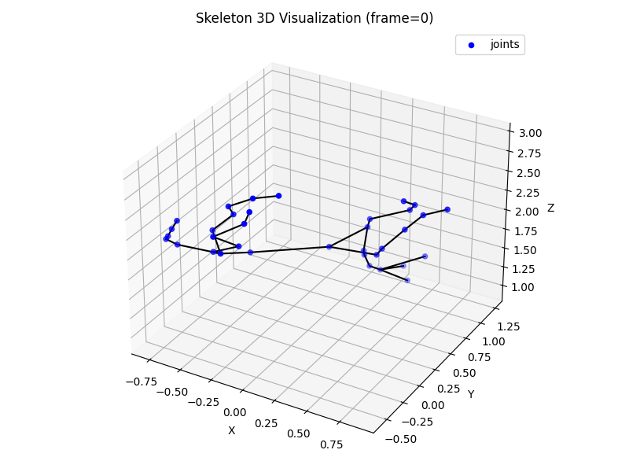

# PFERD/hSMAL データ処理・可視化パイプライン

## 概要

本プロジェクトは、PFERDデータセットおよびhSMALモデルを用いた馬の3Dポーズ・体型・親子構造・物理シミュレーション連携のためのデータ処理・可視化パイプラインです。  
各種npzデータから空間座標・軸角・体型パラメータ・親子間距離などを抽出・変換・可視化し、物理エンジン（MuJoCo等）への応用も想定しています。

---

## セットアップ確認

依存パッケージ・モデル/データセットの配置・デバイス設定が揃っているかは
`python scripts/check_setup.py` で事前に確認できます（`--horse-id` で対象馬IDを指定可能）。

---

## ディレクトリ構成

```
JOINT_MODEL_DATA/
  ├── Spatial_xyz_Data/           # 各ジョイントの空間座標（frameごと、36ジョイント分）
  ├── Angle_xyz_Data_from_poses/  # 各ジョイントの軸角（axis-angle, 36ジョイント分）
  ├── Beta_shape_Data/            # 体型パラメータ（betas, 10次元）
  ├── Parents_Info/               # 親子構造リスト（parents_hsmal36.csv）
  ├── ParentChild_Distances/      # 親子間距離（全フレーム・全親子ペア、統計量も別ファイル）
  ├── Angle_Y_Degree_from_poses/  # 各ジョイントのy軸角度のみ（degree, 相対角度）
  ├── Angle_xyz_Degree_from_poses/# 各ジョイントのxyz角度（degree, 相対角度）
  ├── Absolute_Angles/            # 各ジョイントのxyz絶対角度（degree, ワールド座標系）
  ├── Absolute_Y_Degree/          # 各ジョイントのy軸絶対角度のみ（degree, ワールド座標系）
  ├── Spatial_xyz_Data_from_trans/# モデル全体の並進データ（trans）
  ├── Leg_Joint_Angles/           # 脚部基準ジョイントの絶対角度＋子孫の相対角度、脚用グラフ
  ├── Leg_Joint_Angles_y_only/    # 脚部角度のY軸成分のみ抽出
  ├── Leg_Skeletal_Ratios/        # 各馬の脚部骨格比（セグメント長mm・脚内比率・左右対称性）
  └── Selected_Joint_Graphs/      # 絶対角度と相対角度の比較グラフ・サマリー画像・一覧HTML
```

`Motion_Movie_from_Load_Visualization/` はパイプラインの自動出力ではなく、
`Load_Visualization.py`（ファイル出力なし・ビューワー表示のみ）のセッションを
手動で録画・保存したい場合の慣習的な保存先です。

---

## スクリプト一覧・役割（scripts/ フォルダ）

| スクリプト名 | 概要 |
|:---|:---|
| save_betas_batch.py | npzファイルから体型パラメータ（betas）を抽出し、CSV保存 |
| save_joint_axisangle_batch.py | npzファイルから各ジョイントの軸角（axis-angle）を抽出し、CSV保存（新ジョイント名対応） |
| save_translation_batch.py | npzファイルからモデル全体の並進（trans）を抽出し、CSV保存 |
| forward_kinematics_example.py | npzファイルから各ジョイントの空間座標を計算し、CSV保存（hSMALモデル・パラメータを用いたフォワードキネマティクス。出力は36ジョイント分のxyz座標。座標系や出力例は下記参照） |
| calc_parent_child_distances_batch.py | 空間座標CSVと親子リストCSVから親子間距離・統計量を計算し、CSV保存 |
| extract_joint_y_angle_from_axisangle.py | 各CSVから各関節のy軸角度（degree, 相対角度）のみを抽出し、CSV保存（新ジョイント名対応） |
| extract_joint_xyz_angle_from_axisangle.py | 各CSVから各関節のxyz角度（degree, 相対角度）を抽出し、CSV保存（新ジョイント名対応） |
| calc_absolute_angles_batch.py | 親子構造を用いて各ジョイントの絶対角度（xyz, degree, ワールド座標系）を計算し、CSV保存 |
| extract_joint_y_absolute_angle.py | 絶対角度CSVから各ジョイントのy軸絶対角度のみを抽出し、CSV保存 |
| create_xyz_angle_graphs.py | xyz角度（相対角度, degree）のグラフ（散布図・平滑線）を出力 |
| create_xyz_absolute_angle_graphs.py | xyz絶対角度（degree, ワールド座標系）のグラフ（散布図・平滑線）を出力 |
| save_leg_joint_angles.py | 脚部の基準ジョイント（4,9,18,23）の絶対角度＋その子孫の相対角度をまとめてCSV保存 |
| extract_leg_joint_y_angle.py | 脚部角度CSVからY軸成分（絶対・相対）のみを抽出し、CSV保存 |
| create_leg_joint_angle_graphs.py | 脚部ジョイント角度のグラフ（散布図・平滑線）を出力 |
| plot_joint_angle_comparison.py | 絶対角度と相対角度を同一のy軸範囲で並べたグラフを出力 |
| generate_axis_summary_images.py | 絶対角度・相対角度のグラフを左右に連結したサマリー画像を生成 |
| generate_axis_gallery_html.py | サマリー画像の一覧HTMLギャラリーを生成 |
| check_yaxis_range.py | 絶対角度・相対角度グラフのy軸範囲が一致しているか検証（パイプライン最終ステップ） |

`check_joint_count.py` 等 `scripts/others/` 配下のスクリプトは個別実行の診断・可視化ツールで、
`scripts/batch/update_joint_model_data.py` のバッチパイプラインには含まれていません。

---

## 脚部骨格比の導出

`scripts/analysis/calc_leg_skeletal_ratios.py` は、各馬の体型パラメータ（betas）から
脚部の骨格比（セグメント長・脚内比率・左右対称性）を導出します。

```sh
set PYTHONPATH=.
python scripts/analysis/calc_leg_skeletal_ratios.py               # dataset/ 配下の全馬
python scripts/analysis/calc_leg_skeletal_ratios.py --horse-id 4  # ID_4 のみ
python scripts/analysis/calc_leg_skeletal_ratios.py --verify      # 実モーションでの骨長安定性も検証
```

hSMAL/SMALはリグ型モデルのため、**親子ジョイント間の距離（骨長）はポーズを変えても
変化せず、betasだけで決まります**。そのため実betasを与えたTポーズを1フレーム計算すれば
その馬の骨格が定まります（`--verify` を付けると `ParentChild_Distances` の統計と
突き合わせ、実モーション中も骨長が一定であることを確認できます）。

出力は `JOINT_MODEL_DATA/Leg_Skeletal_Ratios/` 配下:

| ファイル | 内容 |
|:---|:---|
| `<horse_id>_leg_segment_lengths_mm.csv` | 馬ごとの明細（セグメント長mm・脚内比率・体幹基準比率） |
| `all_horses_leg_segment_lengths_mm.csv` | 全馬比較（行=馬、列=セグメント、値=長さmm） |
| `all_horses_leg_segment_ratios.csv` | 全馬比較（値=脚内比率。体格差を除いた形状比較用） |
| `all_horses_leg_symmetry.csv` | 左右対称性のチェック結果 |

`ratio_within_leg`（脚内比率）はロボットのリンク長比にそのまま転用でき、
`ratio_to_torso`（体幹基準比率）は馬ごとの体格差を除いた比較に使えます。

---

## ジョイント名・親子構造（最新版）

```
0  pelvis
1  spine1
2  spine2
3  shoulderBlade
4  l_shoulder
5  l_elbow
6  l_carpal
7  lf_fetlock
8  lf_hoof
9  r_shoulder
10 r_elbow
11 r_carpal
12 rf_fetlock
13 rf_hoof
14 neck_under
15 neck_upper
16 head_base
17 head_tip
18 l_hip
19 l_knee
20 l_hock
21 lh_fetlock
22 lh_hoof
23 r_hip
24 r_knee
25 r_hock
26 rh_fetlock
27 rh_hoof
28 tail_base
29 tail_mid
30 tail_mid2
31 tail_mid3
32 tail_tip
33 jaw_tip
34 ear_l
35 ear_r
```

※このリストは`JOINT_MODEL_DATA/Parents_Info/ID_4/parents_hsmal36.csv`に準拠

---

## データ例・可視化例



- 青点：各ジョイント
- 黒線：親子構造（スケルトン）

---

## 座標系について

- **hSMALローカル座標**：X=前方、Y=左、Z=上
- **ワールド座標（可視化・MuJoCo等）**：X=右、Y=上、Z=前
- **本パイプラインの出力（CSV/可視化）**：
    - **X軸**: 横方向（右方向）
    - **Z軸**: 奥行き方向（前方向、床平面）
    - **Y軸**: 上方向（鉛直、Y-up）
    - **Y軸は反転済み（上が正）**
- MuJoCo等の物理エンジンに連携する場合は、座標変換が必要です。

---

## 使い方（例）

パイプライン全体は `scripts/batch/update_joint_model_data.py` が依存順に一括実行します。

```sh
set PYTHONPATH=.

# ID_4 を全ジョイント処理（既定）
python scripts/batch/update_joint_model_data.py

# 別の馬を処理する
python scripts/batch/update_joint_model_data.py --horse-id 1

# 脚部20ジョイントのみグラフ化して大幅に短縮する
python scripts/batch/update_joint_model_data.py --joints legs
```

### 共通オプション

| オプション | 説明 | 既定 |
|:--|:--|:--|
| `--horse-id` | 対象馬ID。`4` でも `ID_4` でも可。環境変数 `PFERD_HORSE_ID` でも指定できる | `ID_4` |
| `--joints` | グラフ化するジョイントの絞り込み。`all` / `legs` / `4,5,6` | `all` |
| `--dpi` | 出力PNGの解像度 | `150` |

`--horse-id` は個別のスクリプトでも同じように使えます。

```sh
python scripts/input_dataset/save_betas_batch.py --horse-id 2
python scripts/input_joint_model_data/relative_angle/create_xyz_angle_graphs.py --joints legs --dpi 100
```

`--joints` と `--dpi` はグラフ生成スクリプトにのみ存在します。処理時間の大半は
グラフ生成が占めるため、脚部だけが必要なら `--joints legs` を指定してください。

---

## トップレベルスクリプト（可視化・評価）

基本的なコマンド例は README.md の Run demo code にもあります。ここでは主に
Load_Visualization.py のオプションを補足し、他の3スクリプトは概要のみ記載します
（詳細は各スクリプトの `--help`、または README.md 参照）。

### Load_Visualization.py

hSMALモデル推定結果（ポーズ・ベータ・トランスレーション）を3Dビューワー（aitviewer）で可視化するためのスクリプトです。  
オプションでモーションキャプチャデータ（C3D）も重ねて表示できます。

### コマンド例

```sh
set KMP_DUPLICATE_LIB_OK=TRUE

python Load_Visualization.py --ID 4 --mocapname 20201129_ID_4_0007 --start 0 --end 100 --downSample 8 --VISUAL_MOCAP
```

- `--ID`: 対象馬ID（例: 4）
- `--mocapname`: モデル推定結果ファイル名（拡張子・パス不要）
- `--start`, `--end`: 可視化するフレーム範囲
- `--downSample`: フレーム間引き（例: 8で30fps相当）
- `--VISUAL_MOCAP`: モーションキャプチャも重ねて表示する場合に指定

### 入出力

- 入力: `CONFIG.py` で指定されたパスのhSMAL推定結果（例: dataset/ID_x/MODEL_DATA/xxxx_hsmal.npz）、hSMALモデル（.pkl）、（オプション）C3Dファイル
- 出力: 3Dビューワーによる可視化（ファイル出力はなし）

### Projection.py

hSMAL推定結果とカメラ情報を用いて画像平面へ投影・可視化するスクリプトです。モーションキャプチャのマーカー再投影も重ねられます。

```sh
python Projection.py --ID 1 --mocapname '20201128_ID_1_0007' --cameraID '20715' --VISUAL --VISUAL_MOCAP
```

### Eval_iou.py

hSMAL推定結果とセグメンテーションマスクのIoU（Intersection over Union）を評価するスクリプトです。

```sh
python Eval_iou.py --ID 1 --mocapname '20201128_ID_1_0007' --VISUAL
```

### Eval_3Ddistance.py

hSMAL推定結果とモーションキャプチャの3Dマーカー距離を評価するスクリプトです。

```sh
python Eval_3Ddistance.py --ID 1 --mocapname '20201128_ID_1_0007' --VISUAL
```

---

## 注意・カスタマイズ

- 各スクリプトの`horse_id`やファイルパスは適宜変更してください。
- 別IDや他のnpzファイルにも対応可能です。
- 可視化や出力形式のカスタマイズも柔軟に対応できます。
- 絶対角度・絶対Y角度の抽出やグラフ化もサポートしています。

---

## お問い合わせ・追加要望

- さらなる可視化、統計解析、物理エンジン連携、データ変換など、ご要望があればご相談ください。

---

このREADMEをベースに、あなたの研究・開発に合わせて自由に追記・編集してください！ 

### forward_kinematics_example.py の詳細

- 入力: dataset/ID_x/MODEL_DATA/xxxx_hsmal.npz（'poses', 'betas', 'trans'を含む）、hSMALdata/my_smpl_0000_horse_new_skeleton_horse.pkl
- 出力: JOINT_MODEL_DATA/Spatial_xyz_Data/ID_x/xxxx_hsmal_joints_xyz.csv（各フレーム・各ジョイントの3次元座標 [mm]）
- 注意: ジョイント数や名称はget_hsmal_segment_names()に従う。
- **出力座標系: X-Z平面、Y-up（Y軸が鉛直上向き、上が正）**
- 実行例:

```sh
set PYTHONPATH=%cd%
python scripts/input_dataset/forward_kinematics_example.py
```

---

### 3Dスケルトン可視化について

かつて `visualize_skeleton_3d.py`（空間座標CSVから1フレーム分のスケルトンをmatplotlibで描画）
がありましたが、現在は削除されています。Tポーズのスケルトン確認には
`scripts/others/visualize_hsmal_skeleton.py` / `visualize_hsmal_tpose_3d.py` を、
モーションの確認には `Load_Visualization.py`（aitviewer）を使ってください。

なお、空間座標CSVを描画する際の座標系は以下の通りです。

- **可視化座標系: X-Z平面、Y-up（Y軸が鉛直上向き、上が正）**
- 軸ラベル: X (mm), Z (mm), Y (mm) 